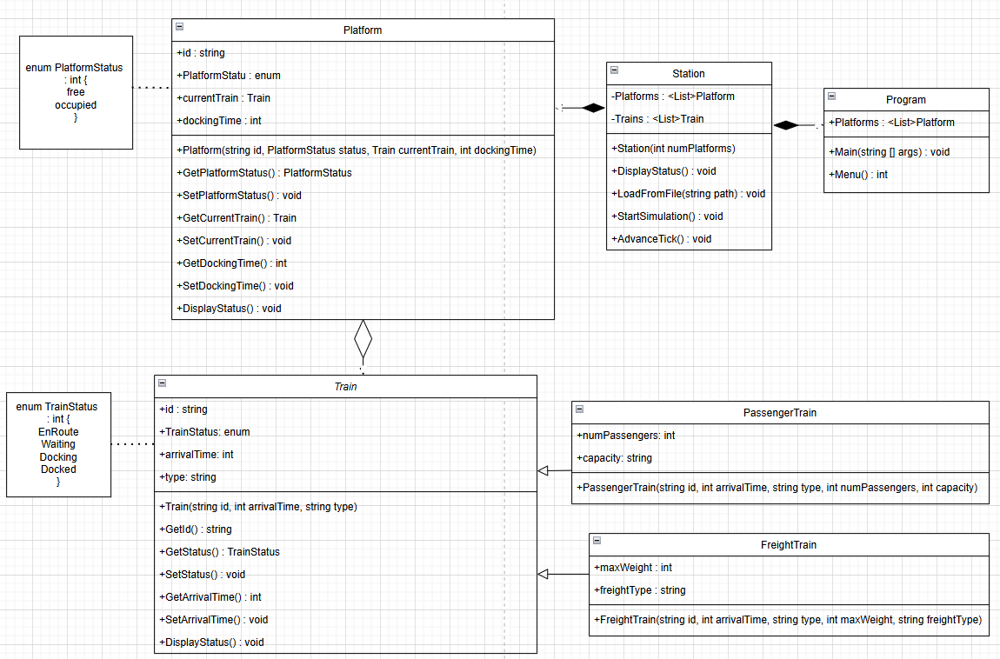

> **UNIVERSIDAD** **FRANCISCO** **DE** **VITORIA**
>
> **ESCUELA** **POLITÉCNICA** **SUPERIOR**
>
> **Object** **Oriented** **Programming** 2ºA, Informatic Engineering
>
> **Practical** **Work** **1** **Extraordinary**
>
> **TRAIN** **STATION**
>
> Ángela Pérez López
>
> Student ID : 43009302227

INDEX

I - INTRODUCTION 3 
II - DESCRIPTION 3 
III - UML DIAGRAM 5 
IV - PROBLEMS 5
V - CONCLUSION 5

**I** **-** **INTRODUCTION**

In this document I will explain the process of my project development.
First to mention that this is an improvement of my Ordinary Practical
Work. I had to create a program that simulated a train station. Here, in
this document, I will explain the description of the program including
the coding choices with the UML diagram, followed the problems and
difficulties and a conclusion to summarize my learnings with this work.

**II** **-** **DESCRIPTION**

The program is divided into the following sections:

> **-** **<u>Program</u>**

First, it starts by asking the user the number of platforms there will
be inside the station. After the user selects a suitable number, the
program displays a menu showing the options that the user can do: load
trains from the file, start the simulation or exit.

*Main():*

> \- Asks the user the number of platforms and stores them to create the
> station. Then has a while loop that contains the switch case with the
> options of the menu.

*Menu()*

> \- Displays the menu and the options of the program.
>
> **-** **<u>Station</u>**

First, it creates the station by using the number of platforms entered
by the user.

*LoadFromFile():*

> \- Reads the file and adds the trains, dividing them by the type of
> train (freight and passengers).

*StartSimulation():*

> \- Calls AdvanceTick() and keeps calling it until all the trains are
> docked, then it displays a message and cuts the simulation.

*AdvanceTick():*

> \- First, it keeps taking away 15 to the arrival time for every tick
> that happens. Once the arrival time gets to 0, it tries to find a free
> platform for the train to dock. If there is a free platform, the
> status of the train changes from EnRoute to Docking and the status of
> the platform changes from Free to Occupied. After 2 ticks, which is
> the docking time, the train changes the status from Docking to Docked
> and the status of the platform changes back to Free to allow another
> Train to go in. However if once the arrival time gets to 0 and there
> are no free platforms, the status changes from EnRoute to Waiting
> until a platform is Free.

*DisplayStatus():*

> \- Displays the current status of the trains, showing the ID, the
> status and the arrival time. Also displays the current status of the
> platforms by indicating if they are free or occupied and if they are
> occupied by what train.
>
> **-** **<u>Platform</u>**

Contains the enums for the platform status to indicate if it's free or
occupied. Also has the setters and the getters of status, current train
and docking time.

*Enum* *PlatFormStatus* *:* *int* 
- Free

> \- Occupied

*DiplayStatus():*

> \- Displays the current status of the platforms by indicating if they
> are free or occupied and if they are occupied by what train.
>
> **-** **<u>Train</u>**

This is an abstract class that contains the declaration, setter and
getters of all the train attributes and that all the train types
(passenger and freight) have in common.

*Enum* *TrainStatus:* *int* 
- EnRoute

> \- Waiting
> - Docking
> - - Docked

*DisplayStatus():*

> \- Displays the current status of the trains, showing the ID, the
> status and the arrival time.
>
> **-** **<u>PassengerTrain</u>**

It is inherited from the class “Train” and includes the specific
attributes from this type of train, number of passengers and capacity.

> **-** **<u>FreightTrain</u>**

It is inherited from the class “Train” and includes the specific
attributes from this type of train, maximum weight and freight type.

> **-** **<u>Trains.csv</u>**

This is the file that contains the trains data in the following order:
*ID,* *ArrivalTime,* *Type,* *AdditionalData1,* *AdditionalData2*

**III** **-** **UML** **DIAGRAM**

This following diagram is the UML (unified modelling language) diagram
of the program:

**IV** **-** **PROBLEMS**

The main problem I had while doing this practical work, was trying to
find a way to optimize our first Practical Work 1, which was in groups.
I had trouble finding a more organized way to develop the program.
However once I manage to do it, I admit that there were easier ways to
create this practical work.

A problem to mention with my program is that the path is only accepted
if it's absolute. Finally, I wanted to add that even though the Trains
take 2 ticks to get docked, in my practical work, they take 2 ticks but
when displayed in the terminal it gets displayed with 1 tick.

**V** **-** **CONCLUSION**

Thanks to this individual practical work, apart from acquiring more
practice for the final exam, I learned to optimize and improve my own
code, making it more organized, simplify and improve the overall
performance.

In conclusion this work helped learn new lessons and prepare me for
future projects, apart from teaching me a new way of coding.
